# 图及图布局算法概述

## 引言

在数字时代，图数据的应用越来越广泛，从社交网络到生物信息学，都离不开图的表示和分析。而图布局算法作为图数据可视化的关键技术之一，帮助我们将复杂的节点和边排列成易于理解和分析的形式。本小册子将带您深入了解图及图布局算法的世界，让我们一起踏上这段关于图及图布局算法的探索之旅吧！

## 什么是图？

图(Graph)是一种复杂的数据结构，用于表示对象之间的多对多关系模型。基于图及其相关算法，可以有效解决许多现实世界问题，如网络路由、社交网络分析以及各种复杂的相互作用系统的建模。

### 图的起源

图最早起源于 18 世纪的欧洲，瑞士数学家 **莱昂哈德·欧拉（Leonhard Euler）** 在解决柯尼斯堡七桥(Seven Bridges of Königsberg)问题时，首次引入了图的概念。他将问题抽象为一张图，其中节点表示岛屿，边表示桥梁，从而奠定了图论的基础。

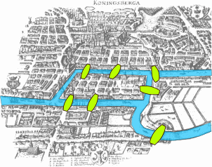

### 图的定义

在数学中，图是一组由边(Edge)相互连接的节点(Node)集合，我们通常用下面的方式定义图：

$$
G = (V, E)
$$

其中, $V$ 表示节点的集合，节点也称为顶点(Vertex)或点(Point)，可以用于表示任何实体、概念或事件，边则表示节点之间的关系。

$E \subseteq \{(x, y) | (x, y) \in V^2\} $ 表示边的集合，边也称为弧(Arc)、链接(Link)或线(Line)，用于表示节点之间的关系。边可以是有向的或无向的，有权重的或无权重的。

节点和边之间的关系可以用邻接矩阵(Adjacency Matrix)或邻接表(Adjacency List)等方式表示。

下面是一个简单的图及其邻接矩阵表示，其中矩阵的行和列分别表示节点，矩阵的值表示两个节点之间是否有边：

<figure style="text-align: center;">
  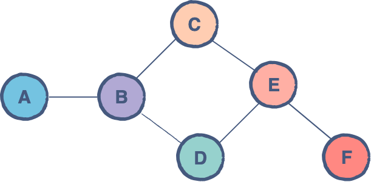
  <figcaption>简单图示例</figcaption>
</figure>

$$
  \begin{bmatrix}
    0 & 1 & 0 & 0 & 0 & 0 \\
    1 & 0 & 1 & 1 & 0 & 0 \\
    0 & 1 & 0 & 0 & 1 & 0 \\
    0 & 1 & 0 & 0 & 1 & 0 \\
    0 & 0 & 1 & 1 & 0 & 1 \\
    0 & 0 & 0 & 0 & 1 & 0
  \end{bmatrix}
$$

### 图的类型

根据图中边的方向和边是否有权重，图可以分为以下几种类型：

- 无向图(Undirected Graph)，边没有方向，如社交网络中的好友关系；

  

- 有向图(Directed Graph)，边有方向，如网页之间的链接关系；

  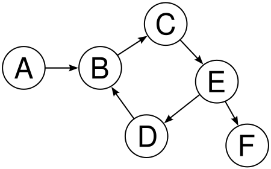

- 加权图(Weighted Graph)，边有权重，如城市之间的距离；

  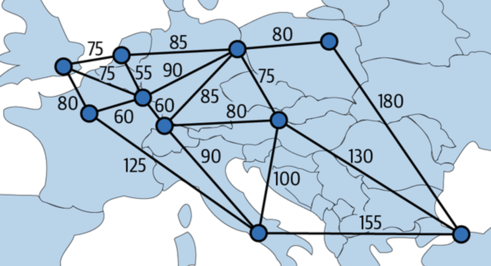

- 无权图(Unweighted Graph)，边没有权重，如地铁线路图。

  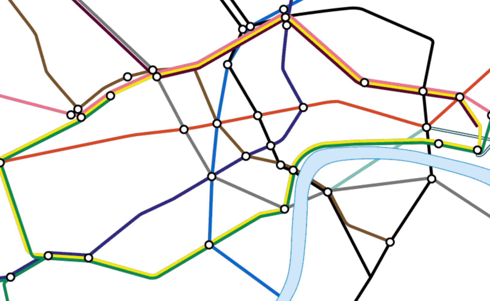

不同类型的图在表示和分析复杂关系时有不同的应用场景，选择合适的图类型有助于更好地理解和分析数据。

上面只是列举了一些常见的图类型，也存在其他划分图的方式，如根据图的结构将图分为树(Tree)、网格(Grid)、网状图(Mesh)等，或者根据图的密度将图分为稀疏图(Sparse Graph)和稠密图(Dense Graph)等。

### 图的应用

当今世界，图论作为一种强大的数学工具，已经渗透到了各个领域。从计算机科学到生物学，从社会学到交通规划，图论都在解决着各种复杂问题。

  
  
  
  
  
  

正如上一节中列举的例子，图可以用于表示各种复杂的关系，如社交网络、交通网络、生物网络等。在实际应用中，图的数据结构和算法被广泛应用于以下领域：

计算机是图应用最为广泛的领域之一，例如网络路由是基于图最短路径算法寻找最优路径。图数据库（如：[TuGraph](https://www.tugraph.org/)）是一种专门用于存储和查询图数据的数据库系统，核心是基于图的关系模型；另外诸如知识图谱、搜索引擎、图像处理等领域也都离不开图的应用。

<figure style="text-align: center;">
  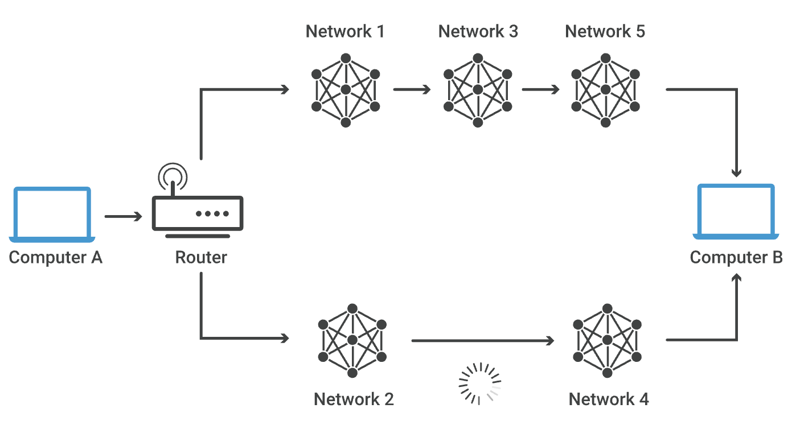
  <figcaption>网络拓扑结构示意图</figcaption>
</figure>

在生物信息学中，图被广泛应用于基因组学、蛋白质相互作用网络、代谢网络等领域。例如，基因组学中的基因调控网络可以用图表示，蛋白质相互作用网络可以用图表示蛋白质之间的相互作用关系。

<figure style="text-align: center;">
  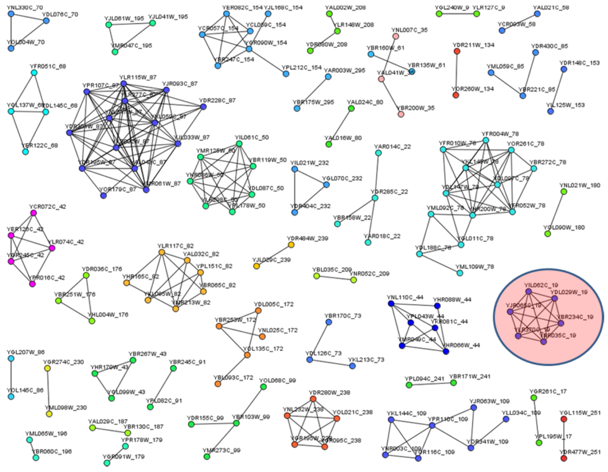
  <figcaption>基于图可视化识别蛋白质复合物</figcaption>
</figure>

在人们日常生活、出行中，图也有着许多重要的应用：地图导航中的路径规划同样是基于图的最短路径算法为用户提供最佳行车路线；社交网络中的推荐系统也是基于图的相似度算法为用户推荐感兴趣的内容。

<figure style="text-align: center;">
  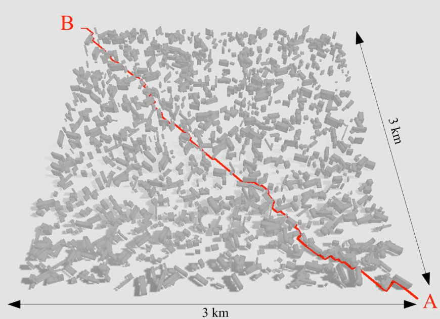
  <figcaption>基于图路径搜索算法进行地理寻径</figcaption>
</figure>

总之，图作为一种强大的数学工具，已经成为解决各种复杂问题的重要工具之一，对于理解和分析现实世界的复杂关系具有重要意义。“图”已经悄无声息地渗透到了我们生活的方方面面。

## 图布局算法概述

<!-- 图是一个复杂的研究领域，已经存在了几十年。 -->

图布局算法是一类旨在优化图表现形式的计算方法，其目的是为了使图的视觉表示更加清晰、易于理解。在图可视化中，节点通常表示为屏幕上的点，边则通过线段连接这些点。布局算法的目标是确定每个节点的位置，以便于分析者能够快速识别出图的结构特征，比如社区结构、中心节点、路径模式等。良好的布局不仅美观，还能有效传达图的内在信息。

对于图布局算法而言，其设计与实现不仅聚焦于上述基础目标，还进一步涵盖了以下几个关键方面，以确保在复杂场景下的适用性和有效性：

1. 动态适应性：随着数据的变化或用户交互的需求，图布局算法应能够动态调整布局，即时响应这些变化，保持图形的清晰度与可读性，特别是在实时数据可视化应用中尤为重要；

<figure style="text-align: center;">
  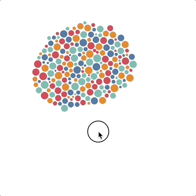
  <figcaption>基于碰撞力的布局算法避开用户指针</figcaption>
</figure>

2. 空间利用率：优化布局以充分利用可用空间，特别是在屏幕尺寸有限或打印介质上，高效的空间分配能帮助展示更多信息而不显拥挤；
3. 可读性：优化布局以突出关键信息或网络结构特征，如社区结构、中心节点或异常模式，帮助用户快速捕捉到数据的重要特征；

  <figure style="text-align: center;">
    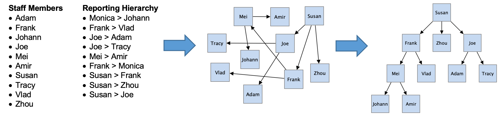
    <figcaption>布局提升图的可读性</figcaption>
  </figure>

4. 稳定性与收敛性：对于基于迭代的布局算法，确保算法能够在合理时间内收敛至一个稳定的布局方案，避免无休止的计算或布局振荡现象；

  <figure style="text-align: center;">
    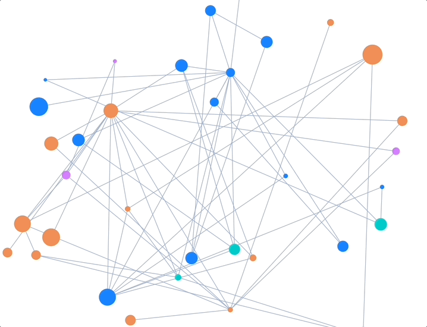
    <figcaption>迭代布局</figcaption>
  </figure>

5. 高性能：对于大规模图，布局算法应具备高效的计算性能，以确保在合理时间内完成布局计算；

  <figure style="text-align: center;">
    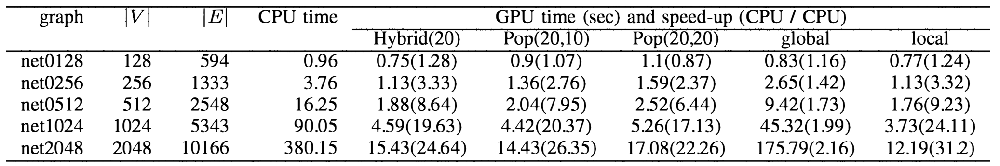
    <figcaption>使用 GPU 版本的力导向布局性能数倍优于 CPU 版本</figcaption>
  </figure>

6. 模拟真实：基于现实世界的物理规律模拟图的布局过程，使得图的布局更加自然和真实。

### 常见布局算法

根据布局结构和计算方法的不同，图布局算法可以分为多种类型，常见的布局算法包括：

- 力导向布局(Force-Directed Layout)算法，基于物理模型模拟节点和边之间的相互作用；
- 环形布局(Circular Layout)算法，将节点和边布局在一个圆形区域内；
- 层次布局(Hierarchical Layout)算法，将图分层布局；
- 网格布局(Grid Layout)算法，将节点和边布局在一个网格中；
- 树形布局(Tree Layout)算法，将图布局成树形结构。

下表从布局适用的图规模、计算性能和空间利用率等方面对这些布局算法进行了简单的对比：

| 布局类型                          | 图规模   | 性能 | 空间利用率 |
| --------------------------------- | -------- | ---- | ---------- |
| 力导向布局(Force-Directed Layout) | 中小规模 | 低   | 中         |
| 环形布局(Circular Layout)         | 大规模   | 高   | 低         |
| 层次布局(Hierarchical Layout)     | 大规模   | 高   | 高         |
| 网格布局(Grid Layout)             | 大规模   | 高   | 高         |
| 树形布局(Tree Layout)             | 大规模   | 高   | 高         |

## 结语

本章节介绍了图及图布局算法的基本概念，包括图的定义、类型、应用以及常见的布局算法。后续章节将深入探讨不同的布局算法的核心思想以及实现逻辑，帮助读者更好地理解和应用图及图布局算法。

## 参考

1. https://www.tomsawyer.com/graph-layout
2. Evaluating Graph Layout Algorithms: A Systematic Review of Methods and Best Practices
3. https://www.data-imaginist.com/posts/2017-02-06-ggraph-introduction-layouts/
4. https://en.wikipedia.org/wiki/Graph_theory
5. Koutrouli, M., Karatzas, E., Paez-Espino, D., & Pavlopoulos, G. A. (2020). A Guide to Conquer the Biological Network Era Using Graph Theory. Frontiers in Bioengineering and Biotechnology, 8. doi:10.3389/fbioe.2020.00034
6. Pavlopoulos, G. A., Secrier, M., Moschopoulos, C. N., Soldatos, T. G., Kossida, S., Aerts, J., … Bagos, P. G. (2011). Using graph theory to analyze biological networks. BioData Mining, 4(1). doi:10.1186/1756-0381-4-10
7. Sobota, B., Szabo, C., & Perhac, J. (2008). Using path-finding algorithms of graph theory for route-searching in geographical information systems. 2008 6th International Symposium on Intelligent Systems and Informatics. doi:10.1109/sisy.2008.4664953
8. https://observablehq.com/@d3/collision-detection
9. Zhang, S., Xu, R. & Quan, Y. Large graph layout optimization based on vision and computational efficiency: a survey. Vis. Intell. 1, 14 (2023). https://doi.org/10.1007/s44267-023-00007-w
10. https://www.ibm.com/docs/en/was-nd/8.5.5?topic=performance-graph-layout-optimizations
11. Y. -X. Wang, Z. -Z. Li, L. Yao, W. Cao and Z. -H. Wang, "Two improved GPU acceleration strategies for force-directed graph layout," 2010 International Conference on Computer Application and System Modeling (ICCASM 2010), Taiyuan, China, 2010, pp. V13-132-V13-136, doi: 10.1109/ICCASM.2010.5622690. keywords: {Graphics processing unit;Gallium nitride;Heating},
